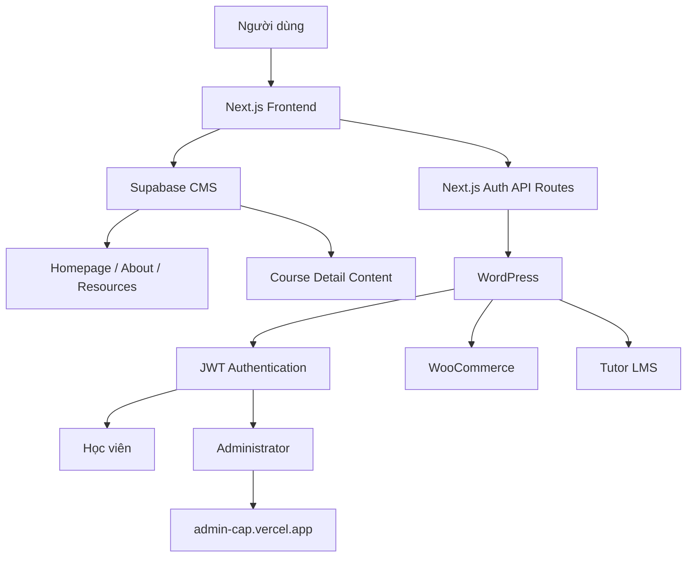
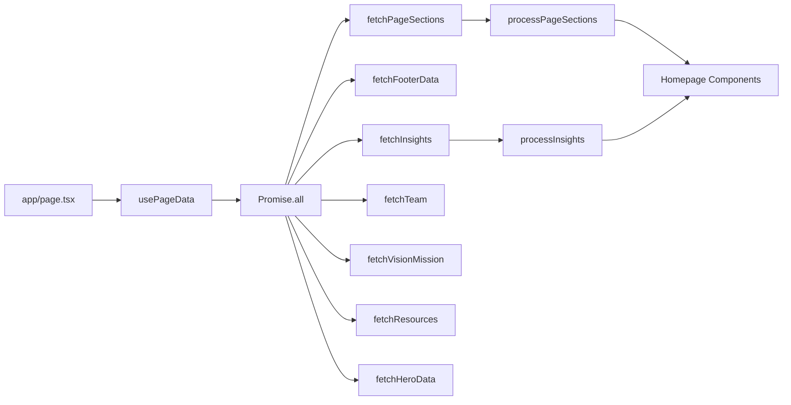
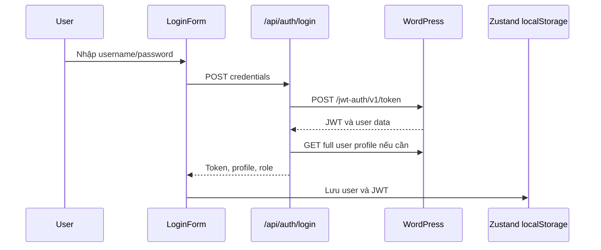

# LearnWithCAP System Logic Report

## 1. Phạm vi phân tích

- Repository gốc: `ezdproduct/learnwithcap`
- Upstream commit được phân tích: `e382f59`
- Framework: Next.js 16, React 19, TypeScript, Tailwind CSS
- Nguồn dữ liệu nội dung: Supabase
- Nguồn tài khoản và xác thực: WordPress, WooCommerce, JWT Auth

Tài liệu này mô tả logic hiện có trong repository. Đây không phải tài liệu đề xuất sửa đổi.

---

## 2. Bản chất hệ thống hiện tại

LearnWithCAP hiện là website marketing và giới thiệu danh mục khóa học, có:

- Nội dung website được quản lý một phần qua Supabase.
- Đăng nhập và đăng ký tài khoản qua WordPress.
- Phân biệt học viên và administrator.
- Chuyển administrator sang một admin app bên ngoài.

Repository chưa phải một hệ thống LMS hoàn chỉnh. Trong repository chưa có nghiệp vụ:

- Mua khóa học.
- Enrollment vào khóa học.
- Xem video hoặc bài học.
- Làm quiz, assignment.
- Theo dõi tiến độ.
- Dashboard học viên.
- Quản lý đơn hàng.

---

## 3. Kiến trúc tổng thể



### Vai trò từng hệ thống

| Hệ thống | Vai trò đang được repository sử dụng |
|---|---|
| Next.js | Giao diện website, API proxy cho auth |
| Supabase | CMS cho nội dung marketing và course detail |
| WordPress | User account, profile và role |
| JWT Auth | Xác thực đăng nhập |
| WooCommerce | Credential server-side dùng để tạo user |
| Tutor LMS | Có tồn tại trên backend nhưng chưa được frontend sử dụng |
| Admin app | Điểm đến của administrator sau đăng nhập |

---

## 4. Route map hiện tại

| Route | Nguồn dữ liệu | Trạng thái |
|---|---|---|
| `/` | Supabase qua `usePageData` | Hoạt động |
| `/about` | Supabase qua `usePageData` | Hoạt động |
| `/resources` | Supabase và mock API cards | Hoạt động một phần |
| `/contact` | Supabase footer | Form chưa gửi dữ liệu |
| `/privacy` | Hardcode | Hoạt động |
| `/login` | WordPress JWT | Hoạt động nếu backend đáp ứng |
| `/register` | WordPress/WooCommerce | Phụ thuộc server credentials |
| `/course-detail` | Hardcode | Legacy/demo page |
| `/online-1-1` | Hardcode | Legacy/demo page |
| `/e-learning` | Hardcode | Legacy/demo page |
| `/courses/enterprise` | Supabase `ld_course_pages` | Hoạt động |
| `/courses/online-1-1` | Supabase `ld_course_pages` | Hoạt động |
| `/courses/e-learning` | Supabase `ld_course_pages` | Hoạt động |
| `/profile` | Không tồn tại | 404 |
| `/shop` | Không tồn tại | 404 |
| `/courses` | Không tồn tại | 404 |

---

## 5. Luồng dữ liệu Supabase

### Tables hiện được sử dụng

| Table | Vai trò | Số bản ghi khi phân tích |
|---|---|---:|
| `ld_page_sections` | Nội dung homepage và navbar | 11 |
| `ld_homepage_footer` | Footer và thông tin liên hệ | 1 |
| `ld_homepage_insights` | Mong muốn và khó khăn | 10 |
| `ld_team` | Thành viên CAP | 3 |
| `ld_vision_mission` | Tầm nhìn và sứ mệnh | 1 |
| `ld_resources` | Tài nguyên/bài viết | 4 |
| `ld_course_pages` | Nội dung chi tiết khóa học | 3 |
| `main_hp_hero` | Hero theo `site_key` | 2 |

### Homepage data flow



### Homepage section keys

- `hero`
- `navbar`
- `services`
- `wants_header`
- `difficulties_header`
- `solutions_header`
- `solutions`
- `courses`
- `clients`
- `testimonials`
- `cta_section`

### Các course slug có trong Supabase

- `enterprise`
- `online-1-1`
- `e-learning`

---

## 6. Luồng homepage hiện tại

```text
User truy cập /
→ Browser render page client-side
→ usePageData gọi song song 7 nhóm query Supabase
→ processPageSections chuyển dữ liệu raw thành state
→ Render:
   Header
   Hero
   Persona/Service carousel
   Wants & Difficulties
   Solutions
   Courses
   Clients
   Testimonials
   CTA
   Footer
```

### Lưu ý

- Homepage là client component.
- `loading` state được tạo nhưng chưa được dùng để render loading UI.
- About và Resources cũng gọi toàn bộ `usePageData`, dù chỉ dùng một phần dữ liệu.
- Chưa có cache layer hoặc React Query.

---

## 7. Luồng khóa học hiện tại

Repository có hai hệ trang khóa học cùng tồn tại.

### Hệ legacy/hardcode

```text
/course-detail
/online-1-1
/e-learning
```

Các trang này chứa nội dung trực tiếp trong source code và chủ yếu thể hiện UI mẫu.

### Hệ lấy dữ liệu Supabase

```text
/courses/enterprise
/courses/online-1-1
/courses/e-learning
```

Các trang này gọi:

```text
fetchCoursePageData(slug)
→ Supabase table ld_course_pages
→ Render hero, features, structure, evaluation, CTA banner
```

### Điểm không đồng nhất

- Homepage course cards luôn dẫn tới `/course-detail`.
- Navbar từ Supabase có dropdown dẫn đúng `/courses/...`.
- Link cha `Khóa Học` trong navbar dẫn `/shop`, nhưng `/shop` không tồn tại.
- Persona cards đều dẫn `/courses`, nhưng `/courses` không tồn tại.
- Footer Supabase có link khóa học dẫn `/shop`.
- Sitemap có `/courses`, nhưng route không tồn tại.

---

## 8. Luồng authentication hiện tại

### Login



### Sau login

```text
Nếu administrator
→ Redirect admin-cap.vercel.app/?key=<JWT>

Nếu user thường
→ Redirect /profile
→ /profile chưa tồn tại
→ 404
```

### Register

```text
User submit form
→ POST /api/auth/register
→ Server dùng WOOCOMMERCE_KEY và WOOCOMMERCE_SECRET
→ Tạo WordPress user role customer
→ Tự động gọi JWT login
→ Lưu token
→ Redirect /profile
```

### Auth state

- Zustand persist store.
- User và JWT được lưu trong browser `localStorage`.
- Logout chỉ xóa state local.
- Không có middleware bảo vệ route.
- Không có refresh token logic.
- `/api/auth/check-admin` tồn tại nhưng không thấy frontend sử dụng.

---

## 9. Chức năng đang hoạt động

- Render nội dung từ Supabase.
- Navbar desktop/mobile.
- Hero video hoặc image slider.
- Service carousel.
- Insights, solutions, clients và testimonials.
- Animation heading và counter.
- Đăng nhập qua WordPress JWT.
- Đăng ký WordPress user nếu có WooCommerce credentials.
- Phân biệt user/admin từ role.
- Chuyển admin sang admin app ngoài.
- Resources tab filter.
- Scroll to top.

---

## 10. Chức năng mới chỉ là giao diện

| Chức năng | Hiện trạng |
|---|---|
| CTA `Tư Vấn` | Phần lớn button chưa có handler/link |
| Contact form | Nút gửi có `type="button"`, không submit |
| Footer newsletter | Không gửi hoặc lưu email |
| Course `Chi tiết` | Nhiều button chưa có handler |
| Course CTA banner | Button chưa có handler |
| Course module card | Không mở module |
| Resource article card | Không mở link |
| Resources API cards | Mock hardcode |
| Course carousel arrows | Có button nhưng chưa có handler |
| Student profile | Route chưa tồn tại |
| Course enrollment | Chưa implement |
| Learning progress | Chưa implement |
| Quiz/assignment | Chưa implement |
| Order/payment | Chưa implement |

---

## 11. Rủi ro và vấn đề cần lưu ý

### Logic sản phẩm

- Chưa xác định rõ website là marketing lead funnel hay một phần của LMS.
- Nhiều CTA không có hành động cuối.
- Login/register dẫn user thường tới route không tồn tại.
- Legacy course pages và Supabase course pages đang trùng mục đích.

### Data

- Database routes và routes trong source không đồng nhất.
- Homepage có 2 course, trong khi `ld_course_pages` có 3 course.
- Hero tồn tại ở cả `ld_page_sections.hero` và `main_hp_hero`.
- Nhiều dữ liệu dùng `any`.
- Một số nội dung Supabase được render qua `dangerouslySetInnerHTML`.

### Security

- JWT lưu trong `localStorage`.
- JWT administrator được truyền qua query string sang admin app.
- Không có middleware/session validation.
- Không có refresh/revoke session flow.

### Maintainability

- Ba trang `/courses/...` có nhiều code lặp.
- Enterprise fetch data client-side, hai course còn lại fetch server-side.
- Không có automated tests.
- Không có route-level loading/error/not-found custom UI.
- README và `OPTIMIZATION_SUMMARY.md` không còn phản ánh chính xác code.
- `src/env.local` được commit nhưng Next.js không tự load vì không nằm ở root với tên `.env.local`.

---

## 12. Logic kinh doanh có thể suy ra

Ý đồ hiện tại có vẻ là:

```text
Marketing website
→ Thu hút cá nhân và doanh nghiệp
→ Giới thiệu giải pháp và khóa học
→ Cho phép đăng nhập bằng tài khoản WordPress/Tutor LMS
→ Administrator đi sang admin app
→ Học viên đi sang profile hoặc hệ thống học
```

Phần đã được triển khai:

```text
Thu hút
→ Giới thiệu
→ Đăng nhập/đăng ký
```

Phần chưa được triển khai trong repository:

```text
Thu lead tư vấn
→ Mua/enroll
→ Profile/dashboard
→ Học tập
→ Theo dõi tiến độ
```

## 13. Trạng thái clean

Tại thời điểm tạo tài liệu:

- Toàn bộ thay đổi logic từng thử nghiệm đã được revert.
- Nội dung code branch fork khớp hoàn toàn với `upstream/master`.
- Tree hash kiểm tra:

```text
66cb8c69e62e92f5e5d51c912d0a56b93bb5eed7
```

Tài liệu này là thay đổi documentation-only, không thay đổi logic ứng dụng.
